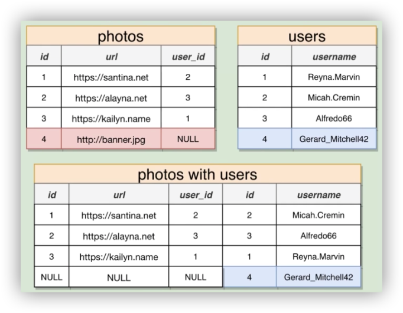

<h1 id='table-of-contents'>TABLE OF CONTENTS</h1>

- [SQL AND POSTGRESQL](#sql-and-postgresql)
  - [Links](#links)
  - [Basics](#basics)
    - [Data Type](#data-type)
    - [CRUD](#crud)
      - [Create Table](#create-table)
      - [Insert Data](#insert-data)
      - [Select Data](#select-data)
      - [Update Data](#update-data)
      - [Delete Data](#delete-data)
    - [Math Operations](#math-operations)
      - [More Operators](#more-operators)
    - [Name Custom Field](#name-custom-field)
    - [String Operations and Functions](#string-operations-and-functions)
  - [Filtering](#filtering)
    - [WHERE](#where)
    - [JOIN](#join)
      - [Types of JOINS](#types-of-joins)
    - [GROUP BY (Groupping)](#group-by-groupping)
      - [Aggregation](#aggregation)
      - [HAVING](#having)
  - [ORDER BY (SORT)](#order-by-sort)
    - [OFFSET](#offset)
    - [LIMIT](#limit)
  - [UNION (Join Two Results)](#union-join-two-results)
    - [UNION ALL](#union-all)
    - [Types Of UNIONs](#types-of-unions)
  - [SubQueries](#subqueries)
    - [Inside SELECT](#inside-select)
    - [Inside FROM](#inside-from)
    - [With JOIN](#with-join)
    - [With IN](#with-in)
    - [With Extra Filter](#with-extra-filter)
    - [Inside SELECT](#inside-select-1)
    - [Inside SELECT Without FROM](#inside-select-without-from)
  - [SELECT](#select)
    - [SELECT DISTINCT (Unique Values)](#select-distinct-unique-values)
    - [SELECT COUNT DISTINCT](#select-count-distinct)
  - [GREATEST](#greatest)
  - [LEAST](#least)
  - [CASE STATEMENT - Generate New Column Base On Condition](#case-statement---generate-new-column-base-on-condition)

# SQL AND POSTGRESQL

## Links

- [SQL On The Browser](https://pg-sql.com/)

## Basics

### Data Type

`VARCHAR`: Variable length character
`INTEGER`: Number without decimal, `-2.147.483.647 to +2.147.483.647`

### CRUD

#### Create Table

```SQL
  CREATE TABLE cities (
    name VARCHAR(50),
    country VARCHAR(50),
    population INTEGER,
    area INTEGER
  );
```

```SQL
  CREATE TABLE users (
    id SERIAL PRIMARY KEY,
    username VARCHAR(50)
  );

  -- SERIAL tells Postgres that this field will be generated by Postgres
  -- PRIMARY KEY
```

- `Keywords`: always capitalized
- `Identifiers`: always lowercase

- Create Table with `FOREIGN KEY`

  ```SQL
    CREATE TABLE photos (
      id SERIAL PRIMARY KEY,
      url VARCHAR(200),
      user_id INTEGER REFERENCES users(id)
    );
  ```

#### Insert Data

Insert single row

```SQL
  INSERT INTO
    cities (name, country, population, area)
  VALUES
    ('Tokyo', 'Japan', 38505000, 8223);
```

```SQL
  INSERT INTO users (username)
  VALUES
    ('monahan93'),
    ('pferrer'),
    ('si93onis'),
    ('99stroman');
```

```SQL
  INSERT INTO
    photos (url, user_id)
  VALUES
    ('http://rogertakeshita.com/1.png', 4),
    ('http://rogertakeshita.com/2.png', 1),
    ('http://rogertakeshita.com/25.png', 1),
    ('http://rogertakeshita.com/36.png', 1),
    ('http://rogertakeshita.com/754.png', 2),
    ('http://rogertakeshita.com/35.png', 3),
    ('http://rogertakeshita.com/2256.png', 4);
```

Insert multiple rows

```SQL
  INSERT INTO
    cities (name, country, population, area)
  VALUES
    ('Delhi', 'India', 2812500, 2240),
    ('Shanghai', 'China', 22125000, 4015),
    ('Sao Paulo', 'Brazil', 20935000, 3043);
```

#### Select Data

```SQL
  SELECT
    *
  FROM
    cities;
```

```SQL
  SELECT
    name, population, area
  FROM
    cities;
```

```SQL
  SELECT
    *
  FROM
    photos
  WHERE
    user_id = 4;
```

#### Update Data

```SQL
  UPDATE
    cities
  SET
    population = 39505000
  WHERE
    name = 'Tokyo';
```

#### Delete Data

```SQL
  DELETE FROM
    cities
  WHERE
    name = 'Tokyo';
```

On delete option

- `ON DELETE RESTRICT`, Throw an error **\*Default**
- `ON DELETE NO ACTION`, Throw an error
- `ON DELETE CASCADE`, Delete from associated tables
- `ON DELETE SET NULL`, Set the `user_id` of the associated tables to `NULL`
- `ON DELETE SET DEFAULT`, Set the `user_id` of the associated tables to a default value, if one is provided

```SQL
  CREATE TABLE photos (
    id SERIAL PRIMARY KEY,
    url VARCHAR(200),
    user_id INTEGER REFERENCES users(id) ON DELETE CASCADE
  );
  INSERT INTO
    photos (url, user_id)
  VALUES
    ('http:/one.jpg', 4),
    ('http:/two.jpg', 1),
    ('http:/25.jpg', 1),
    ('http:/36.jpg', 1),
    ('http:/754.jpg', 2),
    ('http:/35.jpg', 3),
    ('http:/256.jpg', 4);
```

```SQL
  CREATE TABLE photos (
    id SERIAL PRIMARY KEY,
    url VARCHAR(200),
    user_id INTEGER REFERENCES users(id) ON DELETE SET NULL
  );
  INSERT INTO
    photos (url, user_id)
  VALUES
    ('http:/one.jpg', 4),
    ('http:/754.jpg', 2),
    ('http:/35.jpg', 3),
    ('http:/256.jpg', 4);
```

### Math Operations

- `+` Add
- `-` Subtract
- `*` Multiply
- `/` Divide
- `^` Exponent
- `|/` Square root
- `@` Absolute value
- `%` Remainder
- `=` Are the values equal?
- `>` Is the value on the left greater?
- `<` Is the value on the left less?
- `>=` Is the value on the left greater or equal to?
- `<=` Is the value on the left lesser or equal to?
- `IN` Is the value present in a list?
- `<>` Are the values not equal?
- `!=` Are the values not equal?
- `BETWEEN` Is the value between two or other values?
- `NOT IN` Is the value not present in a list?

```SQL
  SELECT
    name, population / area
  FROM
    cities;
```

#### More Operators

Compare structure of data the subquery must return (single column)

- `> ALL`
- `< ALL`
- `>= ALL`
- `<= ALL`
- `= ALL`
- `<> ALL`

- `> SOME`
- `< SOME`
- `>= SOME`
- `<= SOME`
- `= SOME`
- `<> SOME`

- `> ANY`
- `< ANY`
- `>= ANY`
- `<= ANY`
- `= ANY`
- `<> ANY`

```SQL
  SELECT
    name department,
    price
  FROM
    products
  WHERE
    price > ALL (
      SELECT
        price
      FROM
        products
      WHERE
        department = 'Industrial'
    )
```

### Name Custom Field

```SQL
  SELECT
    name, population / area AS population_density
  FROM
    cities;
```

```SQL
  SELECT
    name, price * units_sold AS revenue
  FROM
    phones;
```

### String Operations and Functions

- `||` Join two strings
- `CONCAT()` Join two strings
- `LOWER()` Gives a lower case string
- `LENGTH()` Gives number of characters in a string
- `UPPER()` Gives an upper case string

```SQL
  SELECT
    name || ', ' || country AS location
  FROM
      cities;

  -- OR

  SELECT
    CONCAT(name, ', ', country) AS location
  FROM
      cities;
```

```SQL
  SELECT
    CONCAT(UPPER(name), ', ', UPPER(country)) AS location
  FROM
      cities;

  -- OR

  SELECT
    UPPER(CONCAT(name, ', ', country)) AS location
  FROM
    cities;
```

## Filtering

Order

```SQL
  SELECT name FROM cities WHERE area > 4000;
  -- |          |          └── Second
  -- |          └── First
  -- └── Third
```

### WHERE

- Greater

  ```SQL
    SELECT
      name, area
    FROM
      cities
    WHERE
      area > 4000;
  ```

- Equal

  ```SQL
    SELECT
      name, area
    FROM
      cities
    WHERE
      area = 8223;
  ```

- Not Equal

  ```SQL
    SELECT
      name, area
    FROM
      cities
    WHERE
      area != 8223;

    -- OR

    SELECT
      name, area
    FROM
      cities
    WHERE
      area <> 8223;
  ```

- BETWEEN

  ```SQL
    SELECT
      name, area
    FROM
      cities
    WHERE
      area BETWEEN 2000 AND 4000;
  ```

- IN

  ```SQL
    SELECT
      name, area
    FROM
      cities
    WHERE
      name IN ('Delhi', 'Shanghai');
  ```

  ```SQL
    SELECT
      name, area
    FROM
      cities
    WHERE
      name NOT IN ('Delhi', 'Shanghai');
  ```

  ```SQL
    SELECT
      name, area
    FROM
      cities
     WHERE
       area NOT IN (3043, 8223);
  ```

- Chaining

  ```SQL
    SELECT
      name, area
    FROM
      cities
    WHERE
      area NOT IN (3043, 8223) AND name = 'Delhi';
  ```

  ```SQL
    SELECT
      name,
      area
    FROM
      cities
    WHERE
      area NOT IN (3043, 8223)
      OR name = 'Delhi'
      OR name = 'Tokyo';
  ```

- Calculation

  ```SQL
    SELECT
      name,
      population / area AS population_density
    FROM
      cities
    WHERE
      population / area > 6000;
  ```

### JOIN

Base query

```SQL
  CREATE TABLE users(
    id SERIAL PRIMARY KEY,
    username VARCHAR(50)
  );

  CREATE TABLE photos (
    id SERIAL PRIMARY KEY,
    url VARCHAR(200),
    user_id INTEGER REFERENCES users(id) ON DELETE CASCADE
  );

  CREATE TABLE comments (
    id SERIAL PRIMARY KEY,
    contents VARCHAR(240),
    user_id INTEGER REFERENCES users(id) ON DELETE CASCADE,
    photo_id INTEGER REFERENCES photos(id) ON DELETE CASCADE
  );

  INSERT INTO users (username)
  VALUES
    ('Reyna.Marvin'),
          ('Micah.Cremin'),
          ('Alfredo66'),
          ('Gerard_Mitchell42'),
          ('Frederique_Donnelly');

  INSERT INTO photos (url, user_id)
  VALUES
    ('https://santina.net', 3),
          ('https://alayna.net', 5),
          ('https://kailyn.name', 3),
          ('http://marjolaine.name', 1),
          ('http://chet.net', 5),
          ('http://jerrold.org', 2),
          ('https://meredith.net', 4),
          ('http://isaias.net', 4),
          ('http://dayne.com', 4),
          ('http://colten.net', 2),
          ('https://adelbert.biz', 5),
          ('http://kolby.org', 1),
          ('https://deon.biz', 2),
          ('https://marina.com', 5),
          ('http://johnson.info', 1),
          ('https://linda.info', 2),
          ('https://tyrique.info', 4),
          ('http://buddy.info', 5),
          ('https://elinore.name', 2),
          ('http://sasha.com', 3);

  INSERT INTO comments (contents, user_id, photo_id)
  VALUES
    ('Quo velit iusto ducimus quos a incidunt nesciunt facilis.', 2, 4),
          ('Non est totam.', 5, 5),
          ('Fuga et iste beatae.', 3, 3),
          ('Molestias tempore est.', 1, 5),
          ('Est voluptatum voluptatem voluptatem est ullam quod quia in.', 1, 5),
          ('Aut et similique porro ullam.', 1, 3),
          ('Fugiat cupiditate consequatur sit magni at non ad omnis.', 1, 2),
          ('Accusantium illo maiores et sed maiores quod natus.', 2, 5),
          ('Perferendis cumque eligendi.', 1, 2),
          ('Nihil quo voluptatem placeat.', 5, 5),
          ('Rerum dolor sunt sint.', 5, 2),
          ('Id corrupti tenetur similique reprehenderit qui sint qui nulla tenetur.', 2, 1),
          ('Maiores quo quia.', 1, 5),
          ('Culpa perferendis qui perferendis eligendi officia neque ex.', 1, 4),
          ('Reprehenderit voluptates rerum qui veritatis ut.', 1, 1),
          ('Aut ipsum porro deserunt maiores sit.', 5, 3),
          ('Aut qui eum eos soluta pariatur.', 1, 1),
          ('Praesentium tempora rerum necessitatibus aut.', 4, 3),
          ('Magni error voluptas veniam ipsum enim.', 4, 2),
          ('Et maiores libero quod aliquam sit voluptas.', 2, 3),
          ('Eius ab occaecati quae eos aut enim rem.', 5, 4),
          ('Et sit occaecati.', 4, 3),
          ('Illum omnis et excepturi totam eum omnis.', 1, 5),
          ('Nemo nihil rerum alias vel.', 5, 1),
          ('Voluptas ab eius.', 5, 1),
          ('Dolor soluta quisquam voluptatibus delectus.', 3, 5),
          ('Consequatur neque beatae.', 4, 5),
          ('Aliquid vel voluptatem.', 4, 5),
          ('Maiores nulla ea non autem.', 4, 5),
          ('Enim doloremque delectus.', 1, 4),
          ('Facere vel assumenda.', 2, 5),
          ('Fugiat dignissimos dolorum iusto fugit voluptas et.', 2, 1),
          ('Sed cumque in et.', 1, 3),
          ('Doloribus temporibus hic eveniet temporibus corrupti et voluptatem et sint.', 5, 4),
          ('Quia dolorem officia explicabo quae.', 3, 1),
          ('Ullam ad laborum totam veniam.', 1, 2),
          ('Et rerum voluptas et corporis rem in hic.', 2, 3),
          ('Tempora quas facere.', 3, 1),
          ('Rem autem corporis earum necessitatibus dolores explicabo iste quo.', 5, 5),
          ('Animi aperiam repellendus in aut eum consequatur quos.', 1, 2),
          ('Enim esse magni.', 4, 3),
          ('Saepe cumque qui pariatur.', 4, 4),
          ('Sit dolorem ipsam nisi.', 4, 1),
          ('Dolorem veniam nisi quidem.', 2, 5),
          ('Porro illum perferendis nemo libero voluptatibus vel.', 3, 3),
          ('Dicta enim rerum culpa a quo molestiae nam repudiandae at.', 2, 4),
          ('Consequatur magnam autem voluptas deserunt.', 5, 1),
          ('Incidunt cum delectus sunt tenetur et.', 4, 3),
          ('Non vel eveniet sed molestiae tempora.', 2, 1),
          ('Ad placeat repellat et veniam ea asperiores.', 5, 1),
          ('Eum aut magni sint.', 3, 1),
          ('Aperiam voluptates quis velit explicabo ipsam vero eum.', 1, 3),
          ('Error nesciunt blanditiis quae quis et tempora velit repellat sint.', 2, 4),
          ('Blanditiis saepe dolorem enim eos sed ea.', 1, 2),
          ('Ab veritatis est.', 2, 2),
          ('Vitae voluptatem voluptates vel nam.', 3, 1),
          ('Neque aspernatur est non ad vitae nisi ut nobis enim.', 4, 3),
          ('Debitis ut amet.', 4, 2),
          ('Pariatur beatae nihil cum molestiae provident vel.', 4, 4),
          ('Aperiam sunt aliquam illum impedit.', 1, 4),
          ('Aut laudantium necessitatibus harum eaque.', 5, 3),
          ('Debitis voluptatum nesciunt quisquam voluptatibus fugiat nostrum sed dolore quasi.', 3, 2),
          ('Praesentium velit voluptatem distinctio ut voluptatum at aut.', 2, 2),
          ('Voluptates nihil voluptatum quia maiores dolorum molestias occaecati.', 1, 4),
          ('Quisquam modi labore.', 3, 2),
          ('Fugit quia perferendis magni doloremque dicta officia dignissimos ut necessitatibus.', 1, 4),
          ('Tempora ipsam aut placeat ducimus ut exercitationem quis provident.', 5, 3),
          ('Expedita ducimus cum quibusdam.', 5, 1),
          ('In voluptates doloribus aut ut libero possimus adipisci iste.', 3, 2),
          ('Sit qui est sed accusantium quidem id voluptatum id.', 1, 5),
          ('Libero eius quo consequatur laudantium reiciendis reiciendis aliquid nemo.', 1, 2),
          ('Officia qui reprehenderit ut accusamus qui voluptatum at.', 2, 2),
          ('Ad similique quo.', 4, 1),
          ('Commodi culpa aut nobis qui illum deserunt reiciendis.', 2, 3),
          ('Tenetur quam aut rerum doloribus est ipsa autem.', 4, 2),
          ('Est accusamus aut nisi sit aut id non natus assumenda.', 2, 4),
          ('Et sit et vel quos recusandae quo qui.', 1, 3),
          ('Velit nihil voluptatem et sed.', 4, 4),
          ('Sunt vitae expedita fugiat occaecati.', 1, 3),
          ('Consequatur quod et ipsam in dolorem.', 4, 2),
          ('Magnam voluptatum molestias vitae voluptatibus beatae nostrum sunt.', 3, 5),
          ('Alias praesentium ut voluptatem alias praesentium tempora voluptas debitis.', 2, 5),
          ('Ipsam cumque aut consectetur mollitia vel quod voluptates provident suscipit.', 3, 5),
          ('Ad dignissimos quia aut commodi vel ut nisi.', 3, 3),
          ('Fugit ut architecto doloremque neque quis.', 4, 5),
          ('Repudiandae et voluptas aut in excepturi.', 5, 3),
          ('Aperiam voluptatem animi.', 5, 1),
          ('Et mollitia vel soluta fugiat.', 4, 1),
          ('Ut nemo voluptas voluptatem voluptas.', 5, 2),
          ('At aut quidem voluptatibus rem.', 5, 1),
          ('Temporibus voluptates iure fuga alias minus eius.', 2, 3),
          ('Non autem laboriosam consectetur officiis aut excepturi nobis commodi.', 4, 3),
          ('Esse voluptatem sed deserunt ipsum eaque maxime rerum qui.', 5, 5),
          ('Debitis ipsam ut pariatur molestiae ut qui aut reiciendis.', 4, 4),
          ('Illo atque nihil et quod consequatur neque pariatur delectus.', 3, 3),
          ('Qui et hic accusantium odio quis necessitatibus et magni.', 4, 2),
          ('Debitis repellendus inventore omnis est facere aliquam.', 3, 3),
          ('Occaecati eos possimus deleniti itaque aliquam accusamus.', 3, 4),
          ('Molestiae officia architecto eius nesciunt.', 5, 4),
          ('Minima dolorem reiciendis excepturi culpa sapiente eos deserunt ut.', 3, 3);
```

- Produces values by merging together rows from different related tables
- Use a join most times that you're asked to find data that involves multiple resources

```SQL
  SELECT contents, username
  FROM comments
  JOIN users ON users.id = comments.user_id;
```

#### Types of JOINS


- `INNER JOIN` / `JOIN` - Default one
- `LEFT OUTER JOIN`, Return the entire left table, and return `NULL` if match doesn't exist on the right table

  

- `RIGHT OUTER JOIN`, Return the entire right table, and return `NULL` if match doesn't exist on the left table

  

- `FULL JOIN`, returns everything and tries to match where is possible

  

```SQL
  -- Three way JOIN
  SELECT contents, url, username
  FROM
   comments AS c
   JOIN photos AS p ON p.user_id = c.user_id
   JOIN users AS u ON c.user_id = u.id AND u.id = p.user_id;

  -- Alternative using WHERE
  SELECT contents, url, username
  FROM
    comments AS c
   JOIN photos AS p ON p.user_id = c.user_id
   JOIN users AS u ON c.user_id = u.id
   WHERE
     p.user_id = c.user_id;
```

### GROUP BY (Groupping)

- Reduces many rows down to fewer rows
- Done by using the `GROUP BY` keyword
- Visualizing the result is key to use

> You can only select the `GROUP BY` condition, to

```SQL
  SELECT user_id
  FROM
    comments
   GROUP BY user_id;

  -- If you try to select different columns, the SQL will throw an error

  SELECT user_id, contents
  FROM
    comments
   GROUP BY user_id;

  -- column "comments.contents" must appear in the GROUP BY clause or be used in an aggregate function
```

> To fix that, we need to use the aggregation function to return other columns

#### Aggregation

- Looks at many rows and calculates a single value
- Words like `most`, `average`, `least` are sign that you need to use an aggregation
- Reduces many values down to one
- Done by using `aggregate functions`

Some aggregate functions

- `COUNT()` - Returns the number of values in a group of values
- `SUM()` - Finds the **sum** of a group of numbers
- `AVG()` - Finds the **average** of a group of numbers
- `MIN()` - Returns the **minimum** value from a group of numbers
- `MAX()` - Returns the **maximum** value from the group of numbers

```SQL
  SELECT MAX(id)
  FROM comments;

  -- 100 (max id in the table)
```

```SQL
  -- Return only the unique ids
  SELECT user_id
  FROM comments
  GROUP BY user_id;

  -- Returns the largest id from a group
  SELECT
    user_id,
    MAX(id)
  FROM
    comments
  GROUP BY
    user_id;

  -- Returns the number of comments per user
  SELECT
    user_id,
    COUNT(id) AS num_comments_created
  FROM
    comments
  GROUP BY
    user_id;

  -- Count the number of comments per photo
  SELECT
    photo_id,
    COUNT(*) AS num_comments_created
  FROM
    comments
  GROUP BY
    photo_id;
```

#### HAVING

Fitlers the set of groups

Usually when we have the `HAVING` keyword, probably we are going to use one of the `aggregation functions`

```SQL
  -- Select photo_id that has comments greater than 2, on the first 2 photos only
  SELECT
    photo_id,
    COUNT(*)
  FROM
    comments
  WHERE
    photo_id < 3
  GROUP BY
    photo_id
  HAVING
    COUNT(*) > 2;
```

```SQL
  -- Select user_id that has commented on the first 50 photos and the user added more than 20 comments on those photos
  SELECT
    user_id,
    COUNT(*)
  FROM
    comments
  WHERE
    photo_id BETWEEN 1 AND 50
  GROUP BY
    user_id
  HAVING
    COUNT(*) > 20;
```

## ORDER BY (SORT)

```SQL
  SELECT *
  FROM products
  ORDER BY price;
```

Sorting by two criterieas and different sort method.

```SQL
  SELECT *
  FROM products
  ORDER BY price, weight DESC;
```

### OFFSET

Select all the user, offset the first 40 users.

```SQL
  SELECT *
  FROM users
  OFFSET 40;
```

### LIMIT

Limit the number of results

```SQL
  SELECT *
  FROM users
  OFFSET 40
  LIMIT 2;
```

## UNION (Join Two Results)

Join the result of two queries.

**ATTENTION:** We can only use `UNION` with results that have the same columns names and compatible data type.

```SQL
  SELECT *
  FROM products
  ORDER BY price DESC
  LIMIT 4;
```

| id  | name                     | department | price | weight |
| --- | ------------------------ | ---------- | ----- | ------ |
| 80  | Small Fresh Gloves       | Garden     | 991   | 8      |
| 7   | Incredible Granite Mouse | Home       | 989   | 2      |
| 38  | Awesome Fresh Keyboard   | Home       | 982   | 30     |
| 46  | Incredible Granite Bacon | Music      | 982   | 9      |

```SQL
  SELECT *
  FROM products
  ORDER BY price / weight DESC
  LIMIT 4;
```

| id  | name                     | department | price | weight |
| --- | ------------------------ | ---------- | ----- | ------ |
| 7   | Incredible Granite Mouse | Home       | 989   | 2      |
| 86  | Refined Concrete Pants   | Sports     | 724   | 2      |
| 24  | Small Plastic Soap       | Beauty     | 345   | 1      |
| 1   | Practical Fresh Shirt    | Toys       | 876   | 3      |

```SQL
  (
    SELECT
      *
    FROM
      products
    ORDER BY
      price DESC
    LIMIT
      4
  )
  UNION
  (
    SELECT
      *
    FROM
      products
    ORDER BY
      price / weight DESC
    LIMIT
      4
  );
```

| id  | name                     | department | price | weight |
| --- | ------------------------ | ---------- | ----- | ------ |
| 38  | Awesome Fresh Keyboard   | Home       | 982   | 30     |
| 86  | Refined Concrete Pants   | Sports     | 724   | 2      |
| 46  | Incredible Granite Bacon | Music      | 982   | 9      |
| 80  | Small Fresh Gloves       | Garden     | 991   | 8      |
| 24  | Small Plastic Soap       | Beauty     | 345   | 1      |
| 7   | Incredible Granite Mouse | Home       | 989   | 2      |
| 1   | Practical Fresh Shirt    | Toys       | 876   | 3      |

> The `UNION` removes duplicates

### UNION ALL

```SQL
  (
    SELECT
      *
    FROM
      products
    ORDER BY
      price DESC
    LIMIT
      4
  )
  UNION ALL
  (
    SELECT
      *
    FROM
      products
    ORDER BY
      price / weight DESC
    LIMIT
      4
  );
```

| id  | name                     | department | price | weight |
| --- | ------------------------ | ---------- | ----- | ------ |
| 80  | Small Fresh Gloves       | Garden     | 991   | 8      |
| 7   | Incredible Granite Mouse | Home       | 989   | 2      |
| 38  | Awesome Fresh Keyboard   | Home       | 982   | 30     |
| 46  | Incredible Granite Bacon | Music      | 982   | 9      |
| 7   | Incredible Granite Mouse | Home       | 989   | 2      |
| 86  | Refined Concrete Pants   | Sports     | 724   | 2      |
| 24  | Small Plastic Soap       | Beauty     | 345   | 1      |
| 1   | Practical Fresh Shirt    | Toys       | 876   | 3      |

### Types Of UNIONs

- `UNION` - Join together the results of two queries and remove duplicate rows
- `UNION ALL` - Join together results of two queries
- `INTERSECT` - Find the rows common in the results of two queries. Removes duplicates
- `INTERSECT ALL` - Find the rows common in the results of two queries (it doesn't show all intersected items)
- `EXCEPT` - Find the rows that are present in first query but not second query. Removes duplicates
- `EXCEPT ALL` - Find the rows that are present in first query but not second query

**INTERSECT**

```SQL
  (
    SELECT
      *
    FROM
      products
    ORDER BY
      price DESC
    LIMIT
      4
  )
  INTERSECT
  (
    SELECT
      *
    FROM
      products
    ORDER BY
      price / weight DESC
    LIMIT
      4
  );
```

| id  | name                     | department | price | weight |
| --- | ------------------------ | ---------- | ----- | ------ |
| 7   | Incredible Granite Mouse | Home       | 989   | 2      |

**EXCPEPT**

Only cares about the left selection (first query), and returns only the items that doesn't exist on the right selection

> **ATTENTION** The order of the queries matter (left query vs right query)

```SQL
  (
    SELECT
      *
    FROM
      products
    ORDER BY
      price DESC
    LIMIT
      4
  )
  EXCEPT
  (
    SELECT
      *
    FROM
      products
    ORDER BY
      price / weight DESC
    LIMIT
      4
  );
```

| id  | name                     | department | price | weight |
| --- | ------------------------ | ---------- | ----- | ------ |
| 38  | Awesome Fresh Keyboard   | Home       | 982   | 30     |
| 46  | Incredible Granite Bacon | Music      | 982   | 9      |
| 80  | Small Fresh Gloves       | Garden     | 991   | 8      |

## SubQueries

- Hard way

  ```SQL
    SELECT
      MAX(price)
    FROM
      products
    WHERE
      department = 'Toys';
  ```

  | name |
  | ---- |
  | 947  |

  ```SQL
    SELECT
      name,
      price
    FROM
      products
    WHERE
      price > 947;
  ```

  | name                     | price |
  | ------------------------ | ----- |
  | Incredible Granite Mouse | 989   |
  | Practical Rubber Mouse   | 948   |
  | Handmade Rubber Chicken  | 959   |
  | Awesome Fresh Keyboard   | 982   |
  | Incredible Granite Bacon | 982   |
  | Fantastic Fresh Chips    | 966   |
  | Small Fresh Gloves       | 991   |

- Using sub queries

  ```SQL
    SELECT
      name,
      price
    FROM
      products
    WHERE
      price > (
        SELECT
          MAX(price)
        FROM
          products
        WHERE
          department = 'Toys'
      );
  ```

  | name                     | price |
  | ------------------------ | ----- |
  | Incredible Granite Mouse | 989   |
  | Practical Rubber Mouse   | 948   |
  | Handmade Rubber Chicken  | 959   |
  | Awesome Fresh Keyboard   | 982   |
  | Incredible Granite Bacon | 982   |
  | Fantastic Fresh Chips    | 966   |
  | Small Fresh Gloves       | 991   |

### Inside SELECT

If we want to add a sub query on the `SELECT` statement, we need to put a query that returns a single value.

```SQL
  SELECT
    name,
    price,
    (
      SELECT
        MAX(price)
      FROM
        products
    )
  FROM
    products
  WHERE
    price > 867;
```

| name                      | price | max |
| ------------------------- | ----- | --- |
| Practical Fresh Shirt     | 876   | 991 |
| Incredible Granite Mouse  | 989   | 991 |
| Generic Fresh Computer    | 926   | 991 |
| Fantastic Metal Chair     | 887   | 991 |
| Handcrafted Rubber Towels | 945   | 991 |
| Practical Rubber Mouse    | 948   | 991 |
| Handmade Rubber Chicken   | 959   | 991 |
| Awesome Fresh Keyboard    | 982   | 991 |
| Incredible Granite Bacon  | 982   | 991 |
| Licensed Steel Towels     | 939   | 991 |
| Sleek Fresh Gloves        | 919   | 991 |
| Fantastic Fresh Chips     | 966   | 991 |
| Small Fresh Gloves        | 991   | 991 |
| Practical Steel Shoes     | 947   | 991 |

```SQL
  SELECT
    name,
    price,
    (
      SELECT
        price
      FROM
        products
       WHERE
        id = 3
    ) AS id_3_price
  FROM
    products
  WHERE
    price > 867;
```

| name                      | price | id_3_price |
| ------------------------- | ----- | ---------- |
| Practical Fresh Shirt     | 876   | 10         |
| Incredible Granite Mouse  | 989   | 10         |
| Generic Fresh Computer    | 926   | 10         |
| Fantastic Metal Chair     | 887   | 10         |
| Handcrafted Rubber Towels | 945   | 10         |
| Practical Rubber Mouse    | 948   | 10         |
| Handmade Rubber Chicken   | 959   | 10         |
| Awesome Fresh Keyboard    | 982   | 10         |
| Incredible Granite Bacon  | 982   | 10         |
| Licensed Steel Towels     | 939   | 10         |
| Sleek Fresh Gloves        | 919   | 10         |
| Fantastic Fresh Chips     | 966   | 10         |
| Small Fresh Gloves        | 991   | 10         |
| Practical Steel Shoes     | 947   | 10         |

### Inside FROM

Any subquery, so log as the outer selects/wheres/etc... are compatible. In other words, we are saying to use a special set of rows.

**ATTENTION** we need to give an alias applied to it

Sub query

```SQL
  SELECT
    name,
    price / weight AS price_weight_ratio
  FROM
    products;
```

| name                  | price_weight_ratio |
| --------------------- | ------------------ |
| Practical Fresh Shirt | 292                |
| Gorgeous Steel Towels | 25                 |
| Rustic Plastic Bacon  | 1                  |
| Tasty Wooden Ball     | 34                 |
| Fantastic Soft Fish   | 1                  |
| ...                   | ...                |

```SQL
  SELECT
    name,
    price_weight_ratio
  FROM
    (
      SELECT
        name,
        price / weight AS price_weight_ratio
      FROM
        products
    ) AS p
  WHERE
    price_weight_ratio > 5;
```

| name                     | price_weight_ratio |
| ------------------------ | ------------------ |
| Practical Fresh Shirt    | 292                |
| Gorgeous Steel Towels    | 25                 |
| Tasty Wooden Ball        | 34                 |
| Gorgeous Concrete Towels | 29                 |
| Incredible Granite Mouse | 494                |
| Gorgeous Rubber Ball     | 200                |
| Generic Fresh Computer   | 84                 |
| Unbranded Cotton Shoes   | 10                 |
| Fantastic Metal Chair    | 98                 |
| ...                      | ...                |

> NOTE: We are selecting `name` and `price_weight_ratio`. We can use our alias in our first query

```SQL
  SELECT
    MAX(price)
  FROM
    products;
```

| max |
| --- |
| 991 |

```SQL
  SELECT
    *
  FROM
    (
      SELECT
        MAX(price)
      FROM
        products
    ) AS p;
```

| max |
| --- |
| 991 |

```SQL
  SELECT
    user_id,
    COUNT(*)
  FROM
    orders
  GROUP BY
    user_id;
```

| user_id | count |
| ------- | ----- |
| 42      | 12    |
| 29      | 11    |
| 4       | 11    |
| 34      | 18    |
| ...     | ...   |

Average of orders

```SQL
  SELECT
    AVG(order_count)
  FROM
    (
      SELECT
        user_id,
        COUNT(*) AS order_count
      FROM
        orders
      GROUP BY
        user_id
    ) AS p;
```

### With JOIN

```SQL
  SELECT
    first_name
  FROM
    users
  JOIN ( you_new_query ) AS o
  ON o.user_id = users.id;

  -- your_new_query
  SELECT
    user_id
  FROM
    orders
  WHERE product_id = 3;
```

```SQL
  SELECT
    user_id
  FROM
    orders
  WHERE product_id = 3;
```

| user_id |
| ------- |
| 34      |
| 16      |
| 45      |
| 13      |
| 41      |

```SQL
  SELECT
    first_name
  FROM
    users
    JOIN (
      SELECT
        user_id
      FROM
        orders
      WHERE
        product_id = 3
    ) AS o ON o.user_id = users.id;
```

| first_name |
| ---------- |
| Luigi      |
| Kaylah     |
| Clara      |
| Violette   |
| Kathryn    |

### With IN

```SQL
  SELECT
    id
  FROM
    orders
  WHERE product_id IN ( your_sub_query );

  -- your_sub_query
  SELECT
    id AS product_id
  FROM
    products
  WHERE
    price / weight > 50;
```

| product_id |
| ---------- |
| 1          |
| 7          |
| 8          |
| 9          |
| ...        |

```SQL
  SELECT
    id AS order_id
  FROM
    orders
  WHERE product_id IN ( SELECT
    id
  FROM
    products
  WHERE
    price / weight > 50 );
```

| order_id |
| -------- |
| 13       |
| 15       |
| 18       |
| 19       |
| ...      |

### With Extra Filter

```SQL
  SELECT
    name, price
  FROM
    products
  WHERE
    price > (
      SELECT
        AVG(price)
      FROM
        products
    )
   ORDER BY price;
```

| name                     | price |
| ------------------------ | ----- |
| Intelligent Metal Mouse  | 509   |
| Unbranded Granite Shirt  | 519   |
| Intelligent Cotton Chips | 521   |
| ...                      | ...   |

```SQL
  SELECT
    name,
    department,
    price
  FROM
    products
  WHERE
    department NOT IN (
      SELECT
        department
      FROM
        products
      WHERE
        price < 100
    )
  ORDER BY
    price;
```

| name                       | department | price |
| -------------------------- | ---------- | ----- |
| Practical Wooden Shoes     | Computers  | 112   |
| Licensed Steel Towels      | Health     | 132   |
| Fantastic Wooden Chair     | Jewelery   | 145   |
| Awesome Steel Mouse        | Clothing   | 175   |
| Awesome Cotton Salad       | Shoes      | 211   |
| Handcrafted Fresh Sausages | Games      | 231   |
| ...                        | ...        | ...   |

```SQL
  SELECT
    name,
    department,
    price
  FROM
    products
  WHERE
    price
```

```SQL
  SELECT
    name,
    department,
    price
  FROM
    products AS p1
  WHERE
    p1.price = (
      SELECT
        MAX(p2.price)
      FROM
        products AS p2
      WHERE
        p2.department = p1.department
    )
  ORDER BY
    price;
```

| name                     | department  | price |
| ------------------------ | ----------- | ----- |
| Handmade Granite Fish    | Electronics | 166   |
| Gorgeous Concrete Towels | Grocery     | 328   |
| Practical Plastic Towels | Games       | 379   |
| Gorgeous Steel Towels    | Outdoors    | 412   |
| Fantastic Cotton Shirt   | Health      | 496   |
| ...                      | ...         | ...   |

### Inside SELECT

```SQL
  SELECT
    name,
    (
      SELECT
        COUNT(*)
      FROM
        orders AS o
      WHERE
        o.product_id = p.id
    ) AS total
  FROM
    products AS p;
```

| name                  | total |
| --------------------- | ----- |
| Practical Fresh Shirt | 7     |
| Gorgeous Steel Towels | 4     |
| Rustic Plastic Bacon  | 5     |
| Tasty Wooden Ball     | 4     |
| ...                   | ...   |

### Inside SELECT Without FROM

```SQL
  SELECT
  (
    SELECT
      MAX(price)
    FROM
      products
  ),
  (
    SELECT
      AVG(price)
    FROM
      products
  );
```

| max | avg                  |
| --- | -------------------- |
| 991 | 498.7300000000000000 |

## SELECT

### SELECT DISTINCT (Unique Values)

Returns only the unique values.

```SQL
  SELECT
    DISTINCT department
  FROM
    products;
```

| department |
| ---------- |
| Tools      |
| Eletronics |
| ...        |

### SELECT COUNT DISTINCT

Return total of unique departments

```SQL
  SELECT
    COUNT(DISTINCT department)
  FROM
    products;
```

Return the combination of department and names (unique)

```SQL
  SELECT
    DISTINCT department, name
  FROM
    products;
```

| department | name                     |
| ---------- | ------------------------ |
| Kids       | Handcrafted Cotton Bacon |
| Sports     | Unbranded Wooden Ball    |
| Beauty     | Small Plastic Soap       |
| Sports     | Handmade Plastic Gloves  |
| ...        | ...                      |

## GREATEST

Find the greatest (max) value bettween numbers of values

```SQL
  SELECT
    name,
    weight,
    GREATEST (weight * 2, 30)
  FROM
    products;
```

| name                  | weight | greatest |
| --------------------- | ------ | -------- |
| Practical Fresh Shirt | 3      | 30       |
| Gorgeous Steel Towels | 16     | 32       |
| Rustic Plastic Bacon  | 6      | 30       |
| Tasty Wooden Ball     | 23     | 46       |

## LEAST

Just like `GREATEST`, returns the **mininum** value

```SQL
  SELECT
    name,
    price,
    LEAST (price * 0.5, 400) black_friday
  FROM
    products;
```

| name                     | price | black_friday |
| ------------------------ | ----- | ------------ |
| Practical Fresh Shirt    | 876   | 400          |
| Gorgeous Steel Towels    | 412   | 206.0        |
| Rustic Plastic Bacon     | 10    | 5.0          |
| Tasty Wooden Ball        | 796   | 398.0        |
| Fantastic Soft Fish      | 10    | 5.0          |
| Gorgeous Concrete Towels | 328   | 164.0        |
| Incredible Granite Mouse | 989   | 400          |

## CASE STATEMENT - Generate New Column Base On Condition

```SQL
  SELECT
    name,
    price,
    (
      CASE
        WHEN price > 600 THEN 'high'
        WHEN price > 300 THEN 'medium'
        ELSE 'cheap'
      END
    ) AS tag
  FROM
    products;
```

| name                  | price | tag    |
| --------------------- | ----- | ------ |
| Practical Fresh Shirt | 876   | high   |
| Gorgeous Steel Towels | 412   | medium |
| Rustic Plastic Bacon  | 10    | cheap  |
| Tasty Wooden Ball     | 796   | high   |
| Fantastic Soft Fish   | 10    | cheap  |
